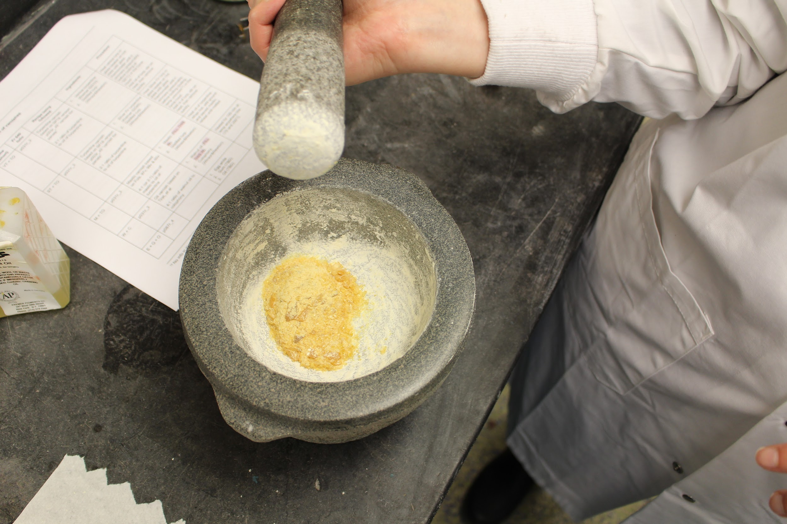
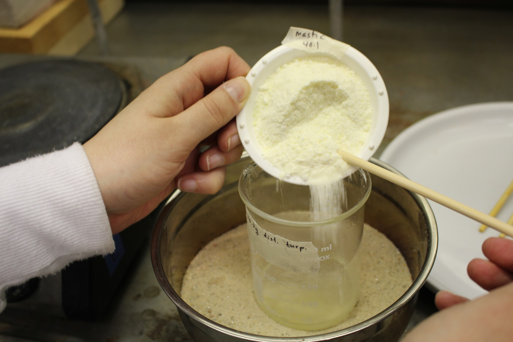
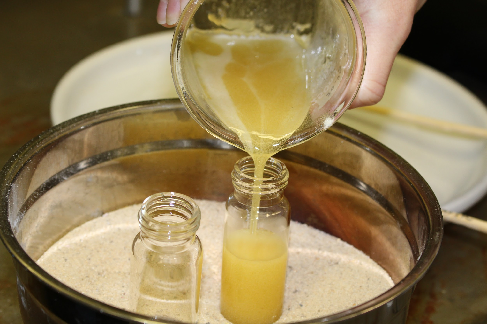
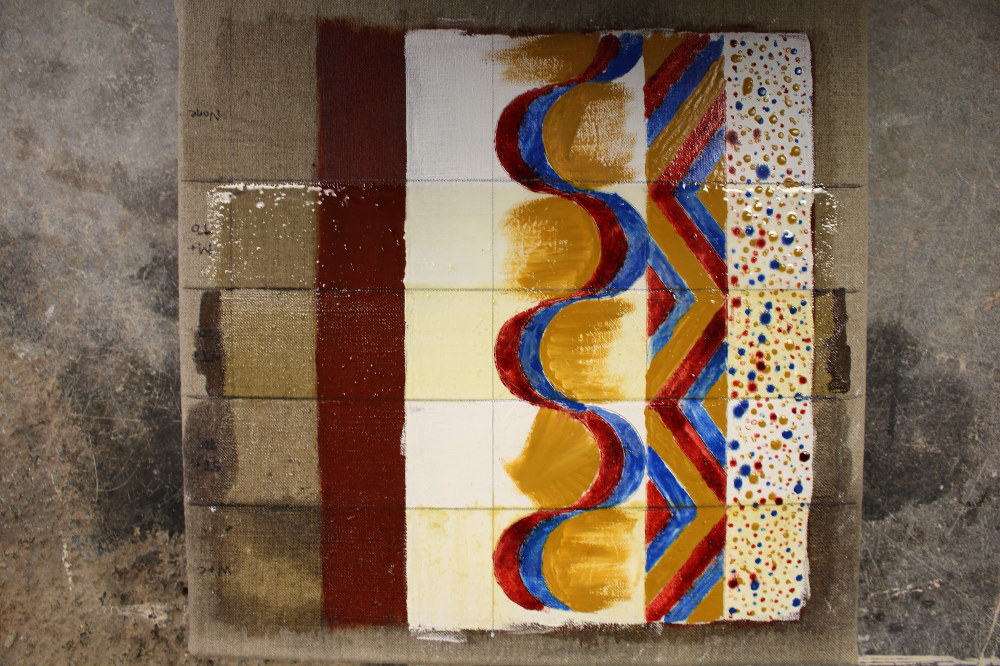

**Table of Contents**

<table>
<colgroup>
<col style="width: 100%" />
</colgroup>
<thead>
<tr class="header">
<th>
<a href="#varnishes-in-the-rain-2-varnish-making-consistency-testing-and-application"><u>Varnishes in the Rain 2: Varnish Making, Consistency Testing, and Application</u></a>

<blockquote>

<a href="#varnish-making"><u>Varnish Making</u></a>

<a href="#am"><u>2018.05.17, 10:30 am</u></a>

<a href="#background"><u>Background</u></a>

<a href="#aims"><u>Aims</u></a>

<a href="#set-up-materials"><u>Set-up &amp; materials</u></a>

<a href="#protocol"><u>Protocol</u></a>

<a href="#process-observations"><u>Process &amp; Observations</u></a>

<a href="#walnut-oil-colophony"><u>WALNUT OIL + COLOPHONY</u></a>

<a href="#silver-fir-turpentine-oil-of-turpentine"><u>SILVER FIR TURPENTINE + OIL OF TURPENTINE</u></a>

<a href="#venice-turpentine-oil-of-turpentine"><u>VENICE TURPENTINE + OIL OF TURPENTINE</u></a>

<a href="#mastic-oil-of-turpentine"><u>MASTIC + OIL OF TURPENTINE</u></a>

<a href="#varnish-color-comparison-and-consistency-testing"><u>Varnish Color Comparison and Consistency Testing</u></a>

<a href="#pm"><u>2018.05.17, 12:20 pm</u></a>

<a href="#aims-1"><u>Aims</u></a>

<a href="#set-up-materials-1"><u>Set-up &amp; materials</u></a>

<a href="#protocol-1"><u>Protocol</u></a>

<a href="#process-observations-1"><u>Process &amp; Observations</u></a>

<a href="#color-comparison"><u>COLOR COMPARISON</u></a>

<a href="#the-knife-test"><u>THE “KNIFE TEST”</u></a>

<a href="#varnish-application"><u>Varnish Application</u></a>

<a href="#pm-1"><u>2018.05.17, 12:30 pm</u></a>

<a href="#aims-2"><u>Aims</u></a>

<a href="#set-up-materials-2"><u>Set-up &amp; materials</u></a>

<a href="#protocol-2"><u>Protocol</u></a>

<a href="#process-observations-2"><u>Process &amp; Observations</u></a>

</blockquote>
<h2 id="section"></h2></th>
</tr>
</thead>
<tbody>
</tbody>
</table>

# Varnishes in the Rain 2: Varnish Making, Consistency Testing, and Application

## Varnish Making

**Name:** Tianna Helena Uchacz and Naomi Rosenkranz

**Date and Time:**

### 2018.05.17, 10:30 am

**Location:** Chandler 260 (Making and Knowing Lab)

**Subject:** Varnish Making

#### Background

-   In previous lab work, we prepared the support and applied the paint
    > layers \[add link\]

    -   Painted oil colors dry enough not to leave color on finger when
        > touched, though not completely dry

    -   Decision made to apply varnish to this partially dry paint in
        > order to better simulate the time constraints of creating
        > ephemeral works like banners and painted canvas arches

#### Aims

-   Prepare the 4 varnishes to be tested:

    -   

| **Short Name** | **Full Name**                               | **Kind**       |
|----------------|---------------------------------------------|----------------|
| W + C          | walnut oil and colophony                    | oil varnish    |
| ST + TO        | Silver Fir turpentine and oil of turpentine | spirit varnish |
| VT + TO        | Venice turpentine and oil of turpentine     | spirit varnish |
| M + TO         | mastic and oil of turpentine                | spirit varnish |

#### Set-up & materials

-   We set up our workspace in the fume hood to include:

    -   Hotplate

    -   Ceramic plate to hold wooden chopsticks used to stir varnishes

    -   Stainless steel bowl with sand to accommodate hot beakers and
        > glass vials

    -   Leather gloves to handle hot beakers

    -   Digital infrared thermometer

        -   Note: difficult to get accurate, uniform reading with this
            > thermometer; all temperatures listed in the observations
            > below are averages or approximations

| **Image URL:**                                                            | [<u>https://www.flickr.com/photos/128418753@N06/40449181630/in/album-72157691299113830/</u>](https://www.flickr.com/photos/128418753@N06/40449181630/in/album-72157691299113830/) |
|---------------------------------------------------------------------------|-----------------------------------------------------------------------------------------------------------------------------------------------------------------------------------|
|  |                                                                                                                                                                                   |

#### Protocol

-   We prepared our varnishes according to the following protocol:

<table>
<colgroup>
<col style="width: 10%" />
<col style="width: 27%" />
<col style="width: 23%" />
<col style="width: 38%" />
</colgroup>
<thead>
<tr class="header">
<th colspan="4"><strong>Varnishes</strong></th>
</tr>
<tr class="odd">
<th><strong>Name (short)</strong></th>
<th><strong>Recipe being followed</strong></th>
<th><strong>Ingredients 
(vendor and item #)</strong></th>
<th><strong>Procedure</strong></th>
</tr>
<tr class="header">
<th>W + C</th>
<th><ul>
<li><blockquote>

Oil varnish based on Tirat, <em>et al</em>1

</blockquote></li>
<li><blockquote>

4:1 ratio of walnut oil to colophony

</blockquote></li>
</ul></th>
<th><ol type="1">
<li><blockquote>

Walnut oil (Kremer 73550)

</blockquote></li>
<li><blockquote>

Colophony (Talas TFK037001)

</blockquote></li>
</ol></th>
<th><ul>
<li><blockquote>

Heat oil to 170°C then add colophony. Keep at temp anywhere between 170 and 250°C for 100 minutes

</blockquote></li>
</ul></th>
</tr>
<tr class="odd">
<th>ST + TO</th>
<th><ul>
<li><blockquote>

Turpentine varnish based on SP18 version of fol. 3r “varnish for panels”2

</blockquote></li>
<li><blockquote>

2:1 ratio of turpentine to oil of turpentine

</blockquote></li>
</ul></th>
<th><ol type="1">
<li><blockquote>

Silver Fir turpentine (Kremer 62040)

</blockquote></li>
<li><blockquote>

Oil of turpentine (Winsor&amp;Newton)

</blockquote></li>
</ol></th>
<th><ul>
<li><blockquote>

Heat Silver Fir turp in glass beaker on hot plate until it simmers (presumably before boiling (boiling temp unknown3) in fume hood. Add oil of turp, stir on heat, then remove quickly

</blockquote></li>
</ul></th>
</tr>
<tr class="header">
<th>VT + TO</th>
<th><ul>
<li><blockquote>

Turpentine varnish based on SP18 version of fol. 3r “varnish for panels”

</blockquote></li>
<li><blockquote>

2:1 ratio of turpentine to oil of turpentine

</blockquote></li>
</ul></th>
<th><ol type="1">
<li><blockquote>

Venice turpentine (Kremer 62010)

</blockquote></li>
<li><blockquote>

Oil of turpentine (Winsor&amp;Newton)

</blockquote></li>
</ol></th>
<th><ul>
<li><blockquote>

Heat Venice turp in glass beaker on hot plate until it simmers (presumably before boiling at 150°C) in fume hood. Add oil of turp, stir on heat, then remove quickly

</blockquote></li>
</ul></th>
</tr>
<tr class="odd">
<th>M + TO</th>
<th><ul>
<li><blockquote>

Mastic varnish based on Fols. <a href="https://edition640.makingandknowing.org/#/folios/97v/f/97v/tl"><u>97v</u></a>, <a href="https://edition640.makingandknowing.org/#/folios/99v/f/99v/tl"><u>99v</u></a> &amp; <a href="https://edition640.makingandknowing.org/#/folios/60v/f/60v/tl"><u>60v</u></a>

</blockquote></li>
<li><blockquote>

4:1 (or 2:1) ratio of mastic to oil of turpentine

</blockquote></li>
</ul></th>
<th><ol type="1">
<li><blockquote>

Mastic (Kremer 60050)

</blockquote></li>
<li><blockquote>

Oil of turpentine (Winsor&amp;Newton)

</blockquote></li>
</ol></th>
<th><ul>
<li><blockquote>

Heat oil of turpentine. When hot, add ground and sieved mastic; reheat until melted

</blockquote></li>
</ul></th>
</tr>
</thead>
<tbody>
</tbody>
</table>

1.  Sophie Tirat et al., “Reconstructing Historical Recipes of Linseed
    Oil/Colophony Varnishes: Influence of Preparation Processes on
    Application Properties,” *Journal of Cultural Heritage*, Wooden
    Musical Instruments Special Issue, 27 (2017): S34–43,
    [<u>https://doi.org/10.1016/j.culher.2017.08.001</u>](https://doi.org/10.1016/j.culher.2017.08.001).

2.  Making and Knowing Team, “Varnishes for Imitation Jasper - Reference
    Copy,”
    [<u>https://fieldnotes.makingandknowing.org/pre-2018-Fall/sp18_mk_team_varnishes-for-imitation-jasper-reference-copy.html</u>](https://fieldnotes.makingandknowing.org/pre-2018-Fall/sp18_mk_team_varnishes-for-imitation-jasper-reference-copy.html).

3.  No info in Kremer MSDS or in Chemwatch database

#### Process & Observations

##### WALNUT OIL + COLOPHONY

-   Colophony quite quite easy to crush

-   Larger amount than needed crushed to a fine powder using large stone
    > mortar and pestle

-   Slightly aromatic

-   Sticky powder—it sticks to mortar, pestle, and itself

-   It cakes

-   It it is not a dry powder

-   Using plastic utensils and weigh boat creates a lot of static
    > electricity, and the powder moves around jumps away from the
    > plastic

| **Image URL:**                                                            | [<u>https://www.flickr.com/photos/128418753@N06/41536808584/in/album-72157691299113830/</u>](https://www.flickr.com/photos/128418753@N06/41536808584/in/album-72157691299113830/) |
|---------------------------------------------------------------------------|-----------------------------------------------------------------------------------------------------------------------------------------------------------------------------------|
|  |                                                                                                                                                                                   |

| **Image URL:**                                                             | [<u>https://www.flickr.com/photos/128418753@N06/41536804104/in/album-72157691299113830/</u>](https://www.flickr.com/photos/128418753@N06/41536804104/in/album-72157691299113830/) |
|----------------------------------------------------------------------------|-----------------------------------------------------------------------------------------------------------------------------------------------------------------------------------|
|  |                                                                                                                                                                                   |

| **Image URL:**                                                            | [<u>https://www.flickr.com/photos/128418753@N06/42211838342/in/album-72157691299113830/</u>](https://www.flickr.com/photos/128418753@N06/42211838342/in/album-72157691299113830/) |
|---------------------------------------------------------------------------|-----------------------------------------------------------------------------------------------------------------------------------------------------------------------------------|
|  |                                                                                                                                                                                   |

-   We will be using hotplate D on level 3

-   Recipe from Tirat et al calls for heating mixture for 100 min
    > between 170 and 250°C

-   DECISION: we will bring walnut oil to 170°C, then add colophony and
    > heat for 60 min

-   10.2 g crushed colophony

-   40.1 g walnut oil

| **Image URL:**                                                             | [<u>https://www.flickr.com/photos/128418753@N06/40449208320/in/album-72157691299113830/</u>](https://www.flickr.com/photos/128418753@N06/40449208320/in/album-72157691299113830/) |
|----------------------------------------------------------------------------|-----------------------------------------------------------------------------------------------------------------------------------------------------------------------------------|
|  |                                                                                                                                                                                   |

-   11:18 am walnut oil in beaker on heat

-   11:21 am 40°C; stirred

-   11:22 am 100°C; stirred

-   11:24 am 140°C; stirred

-   11:26 am 180°C; stirred

-   Remove from heat

-   Add colophony

-   Starts to melt in one big lump and begins to dissolve into smaller
    > lumps

| **Image URL:**                                                            | [<u>https://www.flickr.com/photos/128418753@N06/40449207490/in/album-72157691299113830/</u>](https://www.flickr.com/photos/128418753@N06/40449207490/in/album-72157691299113830/) |
|---------------------------------------------------------------------------|-----------------------------------------------------------------------------------------------------------------------------------------------------------------------------------|
|  |                                                                                                                                                                                   |

| **Image URL:**                                                             | [<u>https://www.flickr.com/photos/128418753@N06/40449207210/in/album-72157691299113830/</u>](https://www.flickr.com/photos/128418753@N06/40449207210/in/album-72157691299113830/) |
|----------------------------------------------------------------------------|-----------------------------------------------------------------------------------------------------------------------------------------------------------------------------------|
|  |                                                                                                                                                                                   |

| **Image URL:**                                                             | [<u>https://www.flickr.com/photos/128418753@N06/27387540857/in/album-72157691299113830/</u>](https://www.flickr.com/photos/128418753@N06/27387540857/in/album-72157691299113830/) |
|----------------------------------------------------------------------------|-----------------------------------------------------------------------------------------------------------------------------------------------------------------------------------|
|  |                                                                                                                                                                                   |

| **Image URL:**                                                             | [<u>https://www.flickr.com/photos/128418753@N06/40451302250/in/album-72157691299113830/</u>](https://www.flickr.com/photos/128418753@N06/40451302250/in/album-72157691299113830/) |
|----------------------------------------------------------------------------|-----------------------------------------------------------------------------------------------------------------------------------------------------------------------------------|
|  |                                                                                                                                                                                   |

-   11:29 am back on heat

-   11:34 am \~160°C; stirred

-   Small and medium lumpy bubbles rising

-   11:37 am 196°C; stirred

-   Solution has been getting increasingly darker, from an amber color
    > toward a reddish hue

-   Chopstick used to stir has attracted some of the gooey lumps; these
    > can be shaken off in the hot varnish

-   11:41 am decision to not stir for 5 minutes to raise temperature and
    > see if small bubbly, gooey bits will dissolve

| **Image URL:**                                                             | [<u>https://www.flickr.com/photos/128418753@N06/40449206390/in/album-72157691299113830/</u>](https://www.flickr.com/photos/128418753@N06/40449206390/in/album-72157691299113830/) |
|----------------------------------------------------------------------------|-----------------------------------------------------------------------------------------------------------------------------------------------------------------------------------|
|  |                                                                                                                                                                                   |

| **Image URL:**                                                             | [<u>https://www.flickr.com/photos/128418753@N06/40449155580/in/album-72157691299113830/</u>](https://www.flickr.com/photos/128418753@N06/40449155580/in/album-72157691299113830/) |
|----------------------------------------------------------------------------|-----------------------------------------------------------------------------------------------------------------------------------------------------------------------------------|
|  |                                                                                                                                                                                   |

| **Image URL:** |     |
|----------------|-----|
|                |     |

-   11:46 am 214°C; stirred

-   Growing darker

-   Fewer smaller chunks

-   11:51 am 197°C; stirred

-   Turned hotplate up a bit

-   11:55 am 223°C; stirred

-   Turned hotplate back to 3; this seems optimal, even with
    > fluctuations

-   11:58 am steam rising

-   12:00 pm darker and reddish

-   Still some small gooey dark lumps

-   gooey lumps that have congealed on chopstick no longer dissolving

-   12:09 pm 227°C; stirred

-   12:15 pm all remaining gooey dark lumps in the varnish have now
    > dissolved. Decision to leave chopstick in the varnish solution for
    > 5 min to see if those congealed lumps will dissolve; stirred
    > throughout and tried to rub stick against side of beaker to
    > promote dissolution

-   12:17 pm seems like some of the chopstick lump is dissolving, but
    > not much and not qickly

-   12:20 pm chopstick out; much of congealed mass remains

-   Wafted smell from varnish: hints of woodiness, umami, hot sauna
    > smell

-   Is this just from having left the chopstick in?

-   12:25 pm 218°C; stirred

-   12:30 pm 222°C; stirred

-   12:40 pm 226°C; stirred

-   12:52 pm 208°C; stirred

-   12:59 pm seems like there has been little change to observe in last
    > few minutes

-   1:10 pm 180°C; stirred

-   1:15 pm 189°C

-   Removed from heat

-   Poured into glass vials

| **Image URL:**                                                             | [<u>https://www.flickr.com/photos/128418753@N06/28385187668/in/album-72157691299113830/</u>](https://www.flickr.com/photos/128418753@N06/28385187668/in/album-72157691299113830/) |
|----------------------------------------------------------------------------|-----------------------------------------------------------------------------------------------------------------------------------------------------------------------------------|
|  |                                                                                                                                                                                   |

| **Image URL:**                                                             | [<u>https://www.flickr.com/photos/128418753@N06/40449201460/in/album-72157691299113830/</u>](https://www.flickr.com/photos/128418753@N06/40449201460/in/album-72157691299113830/) |
|----------------------------------------------------------------------------|-----------------------------------------------------------------------------------------------------------------------------------------------------------------------------------|
|  |                                                                                                                                                                                   |

| **Image URL:**                                                             | [<u>https://www.flickr.com/photos/128418753@N06/40449201120/in/album-72157691299113830/</u>](https://www.flickr.com/photos/128418753@N06/40449201120/in/album-72157691299113830/) |
|----------------------------------------------------------------------------|-----------------------------------------------------------------------------------------------------------------------------------------------------------------------------------|
|  |                                                                                                                                                                                   |

| **Image URL:**                                                            | [<u>https://www.flickr.com/photos/128418753@N06/28384830488/in/album-72157691299113830/</u>](https://www.flickr.com/photos/128418753@N06/28384830488/in/album-72157691299113830/) |
|---------------------------------------------------------------------------|-----------------------------------------------------------------------------------------------------------------------------------------------------------------------------------|
|  |                                                                                                                                                                                   |

| **Image URL:**                                                             | [<u>https://www.flickr.com/photos/128418753@N06/40451714210/in/album-72157691299113830/</u>](https://www.flickr.com/photos/128418753@N06/40451714210/in/album-72157691299113830/) |
|----------------------------------------------------------------------------|-----------------------------------------------------------------------------------------------------------------------------------------------------------------------------------|
|  |                                                                                                                                                                                   |

| **Image URL:**                                                             | [<u>https://www.flickr.com/photos/128418753@N06/41534611384/in/album-72157691299113830/</u>](https://www.flickr.com/photos/128418753@N06/41534611384/in/album-72157691299113830/) |
|----------------------------------------------------------------------------|-----------------------------------------------------------------------------------------------------------------------------------------------------------------------------------|
|  |                                                                                                                                                                                   |

| **Image URL:**                                                             | [<u>https://www.flickr.com/photos/128418753@N06/40449193880/in/album-72157691299113830/</u>](https://www.flickr.com/photos/128418753@N06/40449193880/in/album-72157691299113830/) |
|----------------------------------------------------------------------------|-----------------------------------------------------------------------------------------------------------------------------------------------------------------------------------|
|  |                                                                                                                                                                                   |

| **Image URL:**                                                             | [<u>https://www.flickr.com/photos/128418753@N06/41356732825/in/album-72157691299113830/</u>](https://www.flickr.com/photos/128418753@N06/41356732825/in/album-72157691299113830/) |
|----------------------------------------------------------------------------|-----------------------------------------------------------------------------------------------------------------------------------------------------------------------------------|
|  |                                                                                                                                                                                   |

| **Image URL:**                                                             | [<u>https://www.flickr.com/photos/128418753@N06/28385258248/in/album-72157691299113830/</u>](https://www.flickr.com/photos/128418753@N06/28385258248/in/album-72157691299113830/) |
|----------------------------------------------------------------------------|-----------------------------------------------------------------------------------------------------------------------------------------------------------------------------------|
|  |                                                                                                                                                                                   |

| **Image URL:**                                                             | [<u>https://www.flickr.com/photos/128418753@N06/42212312452/in/album-72157691299113830/</u>](https://www.flickr.com/photos/128418753@N06/42212312452/in/album-72157691299113830/) |
|----------------------------------------------------------------------------|-----------------------------------------------------------------------------------------------------------------------------------------------------------------------------------|
|  |                                                                                                                                                                                   |

##### SILVER FIR TURPENTINE + OIL OF TURPENTINE

-   Silver fir turpentine comparatively easy to work with

-   Runs, pours readily

-   colorless

<!-- -->

-   Using hotplate E on level 3

-   20.1 g Silver Fir turpentine

-   10.04 g oil of turpentine

| **Image URL:**                                                            | [<u>https://www.flickr.com/photos/128418753@N06/27387542027/in/album-72157691299113830/</u>](https://www.flickr.com/photos/128418753@N06/27387542027/in/album-72157691299113830/) |
|---------------------------------------------------------------------------|-----------------------------------------------------------------------------------------------------------------------------------------------------------------------------------|
|  |                                                                                                                                                                                   |

-   11:37 am Silver Fir on heat at 20.9°C

-   11:41 am 177°C; tiny bubbles rising

-   Add oil of turpentine

-   Heat and stir for \~10 sec.

-   Lots of miniscule bubbles forming around the chopstick

-   Removed from heat

-   Poured into glass vials

| **Image URL:**                                                             | [<u>https://www.flickr.com/photos/128418753@N06/41354783405/in/album-72157691299113830/</u>](https://www.flickr.com/photos/128418753@N06/41354783405/in/album-72157691299113830/) |
|----------------------------------------------------------------------------|-----------------------------------------------------------------------------------------------------------------------------------------------------------------------------------|
|  |                                                                                                                                                                                   |

| **Image URL:**                                                             | [<u>https://www.flickr.com/photos/128418753@N06/41356743725/in/album-72157691299113830/</u>](https://www.flickr.com/photos/128418753@N06/41356743725/in/album-72157691299113830/) |
|----------------------------------------------------------------------------|-----------------------------------------------------------------------------------------------------------------------------------------------------------------------------------|
|  |                                                                                                                                                                                   |

| **Image URL:**                                                             | [<u>https://www.flickr.com/photos/128418753@N06/28385242188/in/album-72157691299113830/</u>](https://www.flickr.com/photos/128418753@N06/28385242188/in/album-72157691299113830/) |
|----------------------------------------------------------------------------|-----------------------------------------------------------------------------------------------------------------------------------------------------------------------------------|
|  |                                                                                                                                                                                   |

| **Image URL:**                                                             | [<u>https://www.flickr.com/photos/128418753@N06/27387600347/in/album-72157691299113830/</u>](https://www.flickr.com/photos/128418753@N06/27387600347/in/album-72157691299113830/) |
|----------------------------------------------------------------------------|-----------------------------------------------------------------------------------------------------------------------------------------------------------------------------------|
|  |                                                                                                                                                                                   |

| **Image URL:**                                                             | [<u>https://www.flickr.com/photos/128418753@N06/28384823518/in/album-72157691299113830/</u>](https://www.flickr.com/photos/128418753@N06/28384823518/in/album-72157691299113830/) |
|----------------------------------------------------------------------------|-----------------------------------------------------------------------------------------------------------------------------------------------------------------------------------|
|  |                                                                                                                                                                                   |

| **Image URL:**                                                             | [<u>https://www.flickr.com/photos/128418753@N06/27388078437/in/album-72157691299113830/</u>](https://www.flickr.com/photos/128418753@N06/27388078437/in/album-72157691299113830/) |
|----------------------------------------------------------------------------|-----------------------------------------------------------------------------------------------------------------------------------------------------------------------------------|
|  |                                                                                                                                                                                   |

##### VENICE TURPENTINE + OIL OF TURPENTINE

-   Venice turpentine extremely thick; caramel like in consistency;
    difficult to extract from its jar

-   Dark amber-to-ruby color

-   So resistant that palette knife blade used to extract it begins to
    spin in its handle

<!-- -->

-   We will be using hotplate E on level 3

-   20.39 g Venice turpentine

-   10.00 g oil of turpentine

| **Image URL:**                                                             | [<u>https://www.flickr.com/photos/128418753@N06/41536807334/in/album-72157691299113830/</u>](https://www.flickr.com/photos/128418753@N06/41536807334/in/album-72157691299113830/) |
|----------------------------------------------------------------------------|-----------------------------------------------------------------------------------------------------------------------------------------------------------------------------------|
|  |                                                                                                                                                                                   |

| **Image URL:**                                                             | [<u>https://www.flickr.com/photos/128418753@N06/42211836972/in/album-72157691299113830/</u>](https://www.flickr.com/photos/128418753@N06/42211836972/in/album-72157691299113830/) |
|----------------------------------------------------------------------------|-----------------------------------------------------------------------------------------------------------------------------------------------------------------------------------|
|  |                                                                                                                                                                                   |

-   11:18 am Venice turpentine on heat

-   11:21 am 21°C

-   11:25 am simmering \~170°C

-   11:30 am simmering with small bubbles

-   Remove from heat

-   Add oil of turpentine

-   Stirred to incorporate

-   11:32 am poured varnish into glass vials

| **Image URL:**                                                             | [<u>https://www.flickr.com/photos/128418753@N06/41536804604/in/album-72157691299113830/</u>](https://www.flickr.com/photos/128418753@N06/41536804604/in/album-72157691299113830/) |
|----------------------------------------------------------------------------|-----------------------------------------------------------------------------------------------------------------------------------------------------------------------------------|
|  |                                                                                                                                                                                   |

| **Image URL:**                                                             | [<u>https://www.flickr.com/photos/128418753@N06/40449205370/in/album-72157691299113830/</u>](https://www.flickr.com/photos/128418753@N06/40449205370/in/album-72157691299113830/) |
|----------------------------------------------------------------------------|-----------------------------------------------------------------------------------------------------------------------------------------------------------------------------------|
|  |                                                                                                                                                                                   |

| **Image URL:**                                                             | [<u>https://www.flickr.com/photos/128418753@N06/40449204860/in/album-72157691299113830/</u>](https://www.flickr.com/photos/128418753@N06/40449204860/in/album-72157691299113830/) |
|----------------------------------------------------------------------------|-----------------------------------------------------------------------------------------------------------------------------------------------------------------------------------|
|  |                                                                                                                                                                                   |

| **Image URL:**                                                             | [<u>https://www.flickr.com/photos/128418753@N06/42256223341/in/album-72157691299113830/</u>](https://www.flickr.com/photos/128418753@N06/42256223341/in/album-72157691299113830/) |
|----------------------------------------------------------------------------|-----------------------------------------------------------------------------------------------------------------------------------------------------------------------------------|
|  |                                                                                                                                                                                   |

##### 

##### 

##### MASTIC + OIL OF TURPENTINE

-   Mastic is fragile—it shatters—and is easily broken up by mortar and
    > pestle (medium-sized ceramic)

-   Very aromatic, more of a pine smell than colophony

-   Smell also slightly citrusy, soapy

<!-- -->

-   Using hotplate E on level 3

-   DECISION: start with ration of 2:1 mastic to oil of turpentine; can
    > expand toward 4:1 ratio if varnish seems too runny

-   DECISION: though Venice and Silver Fir turpentines were heated first
    > and then oil of turpentine added when at temp, we will not try to
    > melt mastic directly but heat the oil of turpentine and then add
    > the mastic, watching for signs of excessive volatility of oil of
    > turpentine on heat

-   40.1 g crushed mastic

-   20.2 g oil of turpentine

| **Image URL:**                                                             | [<u>https://www.flickr.com/photos/128418753@N06/41536806804/in/album-72157691299113830/</u>](https://www.flickr.com/photos/128418753@N06/41536806804/in/album-72157691299113830/) |
|----------------------------------------------------------------------------|-----------------------------------------------------------------------------------------------------------------------------------------------------------------------------------|
|  |                                                                                                                                                                                   |

-   11:58 pm oil of turpentine on heat; 21°C

-   12:00 pm 74°C; heat waves in liquid, almost bubbling

-   12:01 pm small bubble starting

-   12:02 pm 140°C

-   Add mastic

-   Remove from heat

-   Granular feel as stirring, like running chopstick through bloated
    > and saturated small pieces of sheet gelatin

-   12:03 pm back on heat

-   Thinning quickly

-   No more resistance

-   Stirring in tipped beaker to get residual powdered mastic off sides
    > of beaker

-   Much thicker in consistency than any other varnish

-   12:06 pm removed from heat

-   Resembles melted honey hair removal wax in its slight crystalline
    > scintillation

-   Smells vaguely sweet

-   Poured into glass vials

-   12:17 very thick in vial already; little movement when vial is
    > tipped

| **Image URL:**                                                             | [<u>https://www.flickr.com/photos/128418753@N06/41356733395/in/album-72157691299113830/</u>](https://www.flickr.com/photos/128418753@N06/41356733395/in/album-72157691299113830/) |
|----------------------------------------------------------------------------|-----------------------------------------------------------------------------------------------------------------------------------------------------------------------------------|
|  |                                                                                                                                                                                   |

| **Image URL:**                                                             | [<u>https://www.flickr.com/photos/128418753@N06/28382920418/in/album-72157691299113830/</u>](https://www.flickr.com/photos/128418753@N06/28382920418/in/album-72157691299113830/) |
|----------------------------------------------------------------------------|-----------------------------------------------------------------------------------------------------------------------------------------------------------------------------------|
|  |                                                                                                                                                                                   |

| **Image URL:**                                                             | [<u>https://www.flickr.com/photos/128418753@N06/42211884752/in/album-72157691299113830/</u>](https://www.flickr.com/photos/128418753@N06/42211884752/in/album-72157691299113830/) |
|----------------------------------------------------------------------------|-----------------------------------------------------------------------------------------------------------------------------------------------------------------------------------|
|  |                                                                                                                                                                                   |

| **Image URL:**                                                             | [<u>https://www.flickr.com/photos/128418753@N06/28384820528/in/album-72157691299113830/</u>](https://www.flickr.com/photos/128418753@N06/28384820528/in/album-72157691299113830/) |
|----------------------------------------------------------------------------|-----------------------------------------------------------------------------------------------------------------------------------------------------------------------------------|
|  |                                                                                                                                                                                   |

| **Image URL:**                                                             | [<u>https://www.flickr.com/photos/128418753@N06/28385261568/in/album-72157691299113830/</u>](https://www.flickr.com/photos/128418753@N06/28385261568/in/album-72157691299113830/) |
|----------------------------------------------------------------------------|-----------------------------------------------------------------------------------------------------------------------------------------------------------------------------------|
|  |                                                                                                                                                                                   |

| **Image URL:**                                                            | [<u>https://www.flickr.com/photos/128418753@N06/42256225521/in/album-72157691299113830/</u>](https://www.flickr.com/photos/128418753@N06/42256225521/in/album-72157691299113830/) |
|---------------------------------------------------------------------------|-----------------------------------------------------------------------------------------------------------------------------------------------------------------------------------|
|  |                                                                                                                                                                                   |

| **Image URL:**                                                             | [<u>https://www.flickr.com/photos/128418753@N06/42256222601/in/album-72157691299113830/</u>](https://www.flickr.com/photos/128418753@N06/42256222601/in/album-72157691299113830/) |
|----------------------------------------------------------------------------|-----------------------------------------------------------------------------------------------------------------------------------------------------------------------------------|
|  |                                                                                                                                                                                   |

| **Image URL:**                                                             | [<u>https://www.flickr.com/photos/128418753@N06/41354770155/in/album-72157691299113830/</u>](https://www.flickr.com/photos/128418753@N06/41354770155/in/album-72157691299113830/) |
|----------------------------------------------------------------------------|-----------------------------------------------------------------------------------------------------------------------------------------------------------------------------------|
|  |                                                                                                                                                                                   |

## Varnish Color Comparison and Consistency Testing

**Name:** Tianna Helena Uchacz and Naomi Rosenkranz

**Date and Time:**

### 2018.05.17, 12:20 pm

**Location:** Chandler 260 (Making and Knowing Lab)

**Subject:** Varnish Consistency Testing: Vial Tipping and the “Knife
Test”

#### Aims

-   Compare the color and consistency of the finished varnishes

-   Assess the utility of the author-practitioner’s “knife test,” as
    > described on fols.
    > [<u>60v</u>](https://edition640.makingandknowing.org/#/folios/60v/f/60v/tl),
    > [<u>88r</u>](https://edition640.makingandknowing.org/#/folios/88r/f/88r/tl),
    > and
    > [<u>97v</u>](https://edition640.makingandknowing.org/#/folios/97v/f/97v/tl)

    -   “There is no need to put in turpentine, but only its white
        > turpentine oil & mastic pulverized at your discretion, until
        > it has enough body. \[...\] which one knows when, being placed
        > on a knife in the wind, it does not run.” (fol. 60v)

    -   “Test on a very clean knife, & you will know then if it has
        > enough body & if it does not run too much.” (88r)

    -   “try it on the knife, and if you see that it has too much body,
        > add in a little turpentine oil, and if it does not have
        > enough, add in mastic, and thus it will be done.” (97v)

#### Set-up & materials

-   For this, we assembled:

    -   Vials containing the four varnishes (W + C, ST + TO, VT + TO,
        > M + TO)

    -   White paper

    -   Palette knife

#### Protocol

-   Line up the varnishes against a background of white paper to better
    assess color

-   The “Knife Test”

    -   Dip a palette knife into the vial of ST + TO varnish to coat

    -   Blow across the surface of the palette knife to simulate wind

    -   Assess the flow of the varnish along the blade

#### Process & Observations

##### COLOR COMPARISON

-   Against a background of white paper, the newly made vials of varnish
    > ranged in color from dark mahogany (W + C) and maroon (VT + TO) to
    > amber (ST + TO) and honey (M + TO)

-   M + TO was comparatively opaque (perhaps due to its thick
    > consistency), while the other three were more transparent

| **Image URL:**                                                             | [<u>https://www.flickr.com/photos/128418753@N06/40451844540/in/album-72157691299113830/</u>](https://www.flickr.com/photos/128418753@N06/40451844540/in/album-72157691299113830/) |
|----------------------------------------------------------------------------|-----------------------------------------------------------------------------------------------------------------------------------------------------------------------------------|
|  |                                                                                                                                                                                   |

##### THE “KNIFE TEST”

-   ST + TO varnish was among the thinnest in consistency, yet it still
    coated the palette knife

-   The varnish rippled easily as we blew across the palette knife,
    suggesting that the varnish, perhaps, did not have adequate “body”
    (which we interpreted to mean viscosity)

<table>
<colgroup>
<col style="width: 16%" />
<col style="width: 83%" />
</colgroup>
<thead>
<tr class="header">
<th><strong>Video URL:</strong></th>
<th><a href="https://vimeo.com/646499532"><u>https://vimeo.com/646499532</u></a></th>
</tr>
<tr class="odd">
<th colspan="2"><blockquote>

<em>Knife test gif as video</em>

</blockquote></th>
</tr>
</thead>
<tbody>
</tbody>
</table>

## Varnish Application

**Name:** Tianna Helena Uchacz and Naomi Rosenkranz

**Date and Time:**

### 2018.05.17, 12:30 pm

**Location:** Chandler 260 (Making and Knowing Lab)

**Subject:** Varnish Application

#### Aims

-   Apply the 4 varnishes in horizontal strips across the previously
    > painted test canvases

-   Informally assess and compare the handling properties of the 4
    > varnishes

#### Set-up & materials

-   Working on a newsprint-covered table, we assembled:

    -   3 previously prepared and painted test canvases

    -   4 varnishes (W + C; ST + TO; VT + TO; M + TO)

    -   1 pencil

    -   4 paintbrushes

    -   4 disposable paper cups

    -   Watercolor paper

#### Protocol

-   Divide each canvas into 5 horizontal strips

-   Pour each varnish into a paper cup

-   Using one paintbrush per varnish type,

    -   Test varnish consistency and handling on watercolor paper

    -   apply varnishes in the pre-defined horizontal bands or strips
        > across the width of the prepared canvas

-   Leaving the bottom strip of each canvas unvarnished

-   Leave canvases to dry

#### Process & Observations

-   12:30: divided painted canvases into 5 horizontal strips using a
    > pencil

    -   Each strip cuts across all of the vertically staggered layers of
        > ground and paint

-   Poured each varnish into its own disposable paper cup

    -   This was straightforward for three of the varnishes (W + C; ST +
        > TO; VT + TO), which were all fairly fluid

    -   This was difficult for the mastic varnish (M + TO), which was
        > especially thick and viscous

-   Working area is now prepared

| **Image URL:**                                                             | [<u>https://www.flickr.com/photos/128418753@N06/41354767205/in/album-72157691299113830/</u>](https://www.flickr.com/photos/128418753@N06/41354767205/in/album-72157691299113830/) |
|----------------------------------------------------------------------------|-----------------------------------------------------------------------------------------------------------------------------------------------------------------------------------|
|  |                                                                                                                                                                                   |

| **Image URL:**                                                             | [<u>https://www.flickr.com/photos/128418753@N06/40451842530/in/album-72157691299113830/</u>](https://www.flickr.com/photos/128418753@N06/40451842530/in/album-72157691299113830/) |
|----------------------------------------------------------------------------|-----------------------------------------------------------------------------------------------------------------------------------------------------------------------------------|
|  |                                                                                                                                                                                   |

| **Image URL:**                                                             | [<u>https://www.flickr.com/photos/128418753@N06/40449178890/in/album-72157691299113830/</u>](https://www.flickr.com/photos/128418753@N06/40449178890/in/album-72157691299113830/) |
|----------------------------------------------------------------------------|-----------------------------------------------------------------------------------------------------------------------------------------------------------------------------------|
|  |                                                                                                                                                                                   |

| **Image URL:**                                                             | [<u>https://www.flickr.com/photos/128418753@N06/28385257788/in/album-72157691299113830/</u>](https://www.flickr.com/photos/128418753@N06/28385257788/in/album-72157691299113830/) |
|----------------------------------------------------------------------------|-----------------------------------------------------------------------------------------------------------------------------------------------------------------------------------|
|  |                                                                                                                                                                                   |

| **Image URL:**                                                             | [<u>https://www.flickr.com/photos/128418753@N06/42209771892/in/album-72157691299113830/</u>](https://www.flickr.com/photos/128418753@N06/42209771892/in/album-72157691299113830/) |
|----------------------------------------------------------------------------|-----------------------------------------------------------------------------------------------------------------------------------------------------------------------------------|
|  |                                                                                                                                                                                   |

-   12:50 pm: began to apply varnish

    -   First applied as test to watercolor paper

    -   Next applied to all three canvases

-   W + C

    -   goes on smoothly

    -   Initially flows off relief areas (e.g., raised dots of the oil
        > paint) as it dries

    -   Went over these areas a few minutes later with the brush in the
        > opposite direction of application

    -   Very yellow in appearance, esp. visible over the lead white;
        > distorts colors beneath

| **Image URL:**                                                             | [<u>https://www.flickr.com/photos/128418753@N06/27385787237/in/album-72157691299113830/</u>](https://www.flickr.com/photos/128418753@N06/27385787237/in/album-72157691299113830/) |
|----------------------------------------------------------------------------|-----------------------------------------------------------------------------------------------------------------------------------------------------------------------------------|
|  |                                                                                                                                                                                   |

| **Image URL:**                                                             | [<u>https://www.flickr.com/photos/128418753@N06/41354765385/in/album-72157691299113830/</u>](https://www.flickr.com/photos/128418753@N06/41354765385/in/album-72157691299113830/) |
|----------------------------------------------------------------------------|-----------------------------------------------------------------------------------------------------------------------------------------------------------------------------------|
|  |                                                                                                                                                                                   |

| **Image URL:**                                                             | [<u>https://www.flickr.com/photos/128418753@N06/27385784527/in/album-72157691299113830/</u>](https://www.flickr.com/photos/128418753@N06/27385784527/in/album-72157691299113830/) |
|----------------------------------------------------------------------------|-----------------------------------------------------------------------------------------------------------------------------------------------------------------------------------|
|  |                                                                                                                                                                                   |

| **Image URL:**                                                             | [<u>https://www.flickr.com/photos/128418753@N06/40449173630/in/album-72157691299113830/</u>](https://www.flickr.com/photos/128418753@N06/40449173630/in/album-72157691299113830/) |
|----------------------------------------------------------------------------|-----------------------------------------------------------------------------------------------------------------------------------------------------------------------------------|
|  |                                                                                                                                                                                   |

| **Image URL:**                                                             | [<u>https://www.flickr.com/photos/128418753@N06/40451863010/in/album-72157691299113830/</u>](https://www.flickr.com/photos/128418753@N06/40451863010/in/album-72157691299113830/) |
|----------------------------------------------------------------------------|-----------------------------------------------------------------------------------------------------------------------------------------------------------------------------------|
|  |                                                                                                                                                                                   |

-   ST + TO

    -   Very runny

    -   Blow test on palette knife (detailed in previous section) shows
        > that varnish is probably a bit runnier than it should be

    -   So runny that it drips easily from brush, runs down handle of
        > brush

    -   Looks like the varnish is absorbed or evaporates or dries near
        > instantly

    -   Very clear in appearance; no visible distortion of colors
        > beneath

| **Image URL:**                                                             | [<u>https://www.flickr.com/photos/128418753@N06/28382890388/in/album-72157691299113830/</u>](https://www.flickr.com/photos/128418753@N06/28382890388/in/album-72157691299113830/) |
|----------------------------------------------------------------------------|-----------------------------------------------------------------------------------------------------------------------------------------------------------------------------------|
|  |                                                                                                                                                                                   |

| **Image URL:**                                                             | [<u>https://www.flickr.com/photos/128418753@N06/42212326292/in/album-72157691299113830/</u>](https://www.flickr.com/photos/128418753@N06/42212326292/in/album-72157691299113830/) |
|----------------------------------------------------------------------------|-----------------------------------------------------------------------------------------------------------------------------------------------------------------------------------|
|  |                                                                                                                                                                                   |

| **Image URL:**                                                             | [<u>https://www.flickr.com/photos/128418753@N06/42212325002/in/album-72157691299113830/</u>](https://www.flickr.com/photos/128418753@N06/42212325002/in/album-72157691299113830/) |
|----------------------------------------------------------------------------|-----------------------------------------------------------------------------------------------------------------------------------------------------------------------------------|
|  |                                                                                                                                                                                   |

| **Image URL:**                                                             | [<u>https://www.flickr.com/photos/128418753@N06/28382904548/in/album-72157691299113830/</u>](https://www.flickr.com/photos/128418753@N06/28382904548/in/album-72157691299113830/) |
|----------------------------------------------------------------------------|-----------------------------------------------------------------------------------------------------------------------------------------------------------------------------------|
|  |                                                                                                                                                                                   |

| **Image URL:**                                                             | [<u>https://www.flickr.com/photos/128418753@N06/40451861530/in/album-72157691299113830/</u>](https://www.flickr.com/photos/128418753@N06/40451861530/in/album-72157691299113830/) |
|----------------------------------------------------------------------------|-----------------------------------------------------------------------------------------------------------------------------------------------------------------------------------|
|  |                                                                                                                                                                                   |

-   VT + TO

    -   Nice, smooth consistency for application

    -   Slightly yellow in appearance, esp. visible over the lead white;
        > slightly distorts colors beneath

| **Image URL:**                                                             | [<u>https://www.flickr.com/photos/128418753@N06/42209779792/in/album-72157691299113830/</u>](https://www.flickr.com/photos/128418753@N06/42209779792/in/album-72157691299113830/) |
|----------------------------------------------------------------------------|-----------------------------------------------------------------------------------------------------------------------------------------------------------------------------------|
|  |                                                                                                                                                                                   |

| **Image URL:**                                                             | [<u>https://www.flickr.com/photos/128418753@N06/28382900198/in/album-72157691299113830/</u>](https://www.flickr.com/photos/128418753@N06/28382900198/in/album-72157691299113830/) |
|----------------------------------------------------------------------------|-----------------------------------------------------------------------------------------------------------------------------------------------------------------------------------|
|  |                                                                                                                                                                                   |

| **Image URL:**                                                             | [<u>https://www.flickr.com/photos/128418753@N06/42212487312/in/album-72157691299113830/</u>](https://www.flickr.com/photos/128418753@N06/42212487312/in/album-72157691299113830/) |
|----------------------------------------------------------------------------|-----------------------------------------------------------------------------------------------------------------------------------------------------------------------------------|
|  |                                                                                                                                                                                   |

| **Image URL:**                                                             | [<u>https://www.flickr.com/photos/128418753@N06/41354754695/in/album-72157691299113830/</u>](https://www.flickr.com/photos/128418753@N06/41354754695/in/album-72157691299113830/) |
|----------------------------------------------------------------------------|-----------------------------------------------------------------------------------------------------------------------------------------------------------------------------------|
|  |                                                                                                                                                                                   |

| **Image URL:**                                                             | [<u>https://www.flickr.com/photos/128418753@N06/41354754455/in/album-72157691299113830/</u>](https://www.flickr.com/photos/128418753@N06/41354754455/in/album-72157691299113830/) |
|----------------------------------------------------------------------------|-----------------------------------------------------------------------------------------------------------------------------------------------------------------------------------|
|  |                                                                                                                                                                                   |

| **Image URL:**                                                             | [<u>https://www.flickr.com/photos/128418753@N06/41354749915/in/album-72157691299113830/</u>](https://www.flickr.com/photos/128418753@N06/41354749915/in/album-72157691299113830/) |
|----------------------------------------------------------------------------|-----------------------------------------------------------------------------------------------------------------------------------------------------------------------------------|
|  |                                                                                                                                                                                   |

-   M + TO

    -   So thick it hardly pours from the vial

    -   Almost too thick to apply with a brush—firm, short-bristled
        > brush works best

    -   Apply in thicker blobs and then pull across paint to even out

    -   Difficult to apply; brushstrokes remain visible in this thick
        > varnish

    -   Very glossy in appearance

    -   Relatively clear in appearance

| **Image URL:**                                                            | [<u>https://www.flickr.com/photos/128418753@N06/40452156360/in/album-72157691299113830/</u>](https://www.flickr.com/photos/128418753@N06/40452156360/in/album-72157691299113830/) |
|---------------------------------------------------------------------------|-----------------------------------------------------------------------------------------------------------------------------------------------------------------------------------|
|  |                                                                                                                                                                                   |

| **Image URL:**                                                             | [<u>https://www.flickr.com/photos/128418753@N06/28385495098/in/album-72157691299113830/</u>](https://www.flickr.com/photos/128418753@N06/28385495098/in/album-72157691299113830/) |
|----------------------------------------------------------------------------|-----------------------------------------------------------------------------------------------------------------------------------------------------------------------------------|
|  |                                                                                                                                                                                   |

| **Image URL:**                                                            | [<u>https://www.flickr.com/photos/128418753@N06/41354747465/in/album-72157691299113830/</u>](https://www.flickr.com/photos/128418753@N06/41354747465/in/album-72157691299113830/) |
|---------------------------------------------------------------------------|-----------------------------------------------------------------------------------------------------------------------------------------------------------------------------------|
|  |                                                                                                                                                                                   |

| **Image URL:**                                                             | [<u>https://www.flickr.com/photos/128418753@N06/40449214450/in/album-72157691299113830/</u>](https://www.flickr.com/photos/128418753@N06/40449214450/in/album-72157691299113830/) |
|----------------------------------------------------------------------------|-----------------------------------------------------------------------------------------------------------------------------------------------------------------------------------|
|  |                                                                                                                                                                                   |

| **Image URL:**                                                             | [<u>https://www.flickr.com/photos/128418753@N06/40449215590/in/album-72157691299113830/</u>](https://www.flickr.com/photos/128418753@N06/40449215590/in/album-72157691299113830/) |
|----------------------------------------------------------------------------|-----------------------------------------------------------------------------------------------------------------------------------------------------------------------------------|
|  |                                                                                                                                                                                   |

-   The fifth and final horizontal strip was left entirely unvarnished

| **Image URL:**                                                             | [<u>https://www.flickr.com/photos/128418753@N06/28385490058/in/album-72157691299113830/</u>](https://www.flickr.com/photos/128418753@N06/28385490058/in/album-72157691299113830/) |
|----------------------------------------------------------------------------|-----------------------------------------------------------------------------------------------------------------------------------------------------------------------------------|
|  |                                                                                                                                                                                   |

| **Image URL:**                                                             | [<u>https://www.flickr.com/photos/128418753@N06/40449213510/in/album-72157691299113830/</u>](https://www.flickr.com/photos/128418753@N06/40449213510/in/album-72157691299113830/) |
|----------------------------------------------------------------------------|-----------------------------------------------------------------------------------------------------------------------------------------------------------------------------------|
|  |                                                                                                                                                                                   |

-   The canvases were put in the fume hood to dry for 3 hours then moved
    to table to dry for 4 days, for fear that the air flow through the
    fume hood might cause more particles to circulate and adhere to the
    tacky surface than otherwise

| **Image URL:**                                                             | [<u>https://www.flickr.com/photos/128418753@N06/40452158920/in/album-72157691299113830/</u>](https://www.flickr.com/photos/128418753@N06/40452158920/in/album-72157691299113830/) |
|----------------------------------------------------------------------------|-----------------------------------------------------------------------------------------------------------------------------------------------------------------------------------|
|  |                                                                                                                                                                                   |

| **Image URL:**                                                             | [<u>https://www.flickr.com/photos/128418753@N06/41354797205/in/album-72157691299113830/</u>](https://www.flickr.com/photos/128418753@N06/41354797205/in/album-72157691299113830/) |
|----------------------------------------------------------------------------|-----------------------------------------------------------------------------------------------------------------------------------------------------------------------------------|
|  |                                                                                                                                                                                   |
